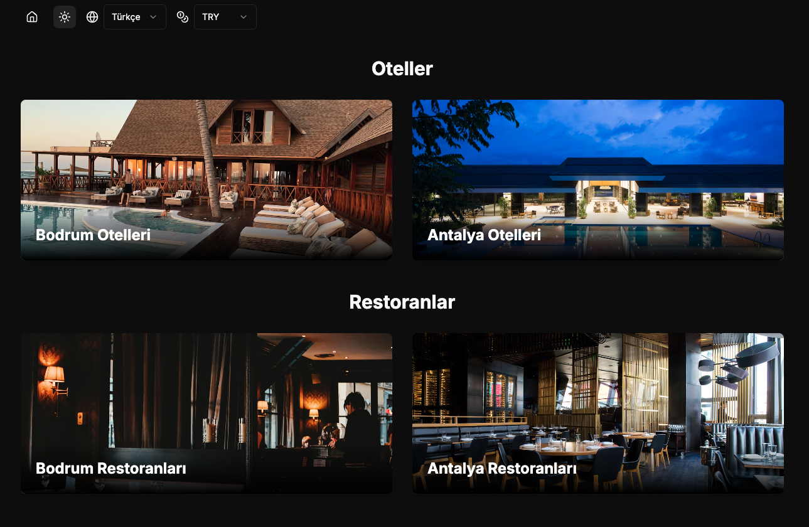
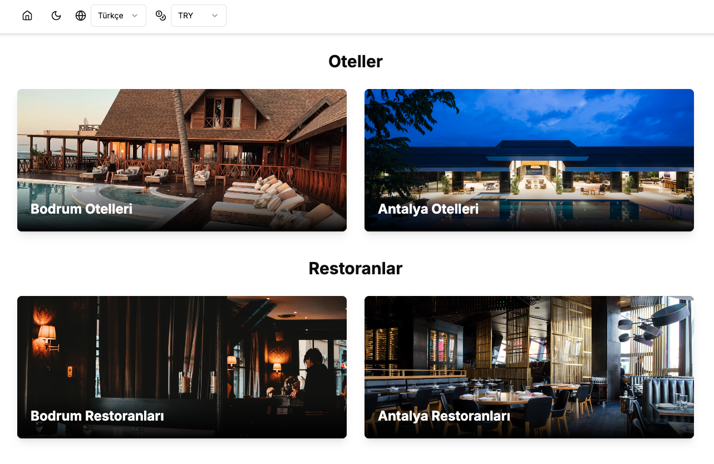
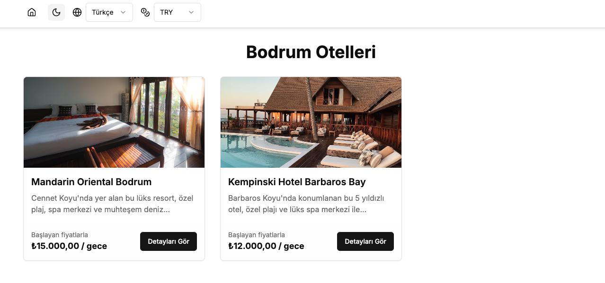
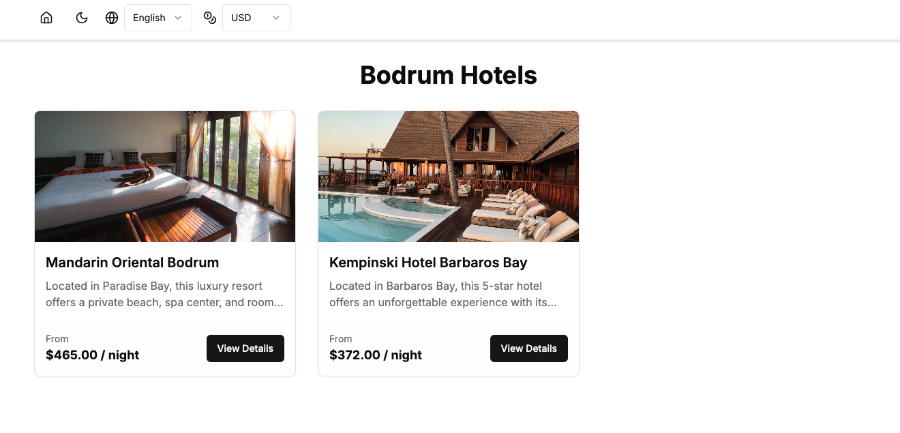

# Facility Code Case

Bu proje, otel ve restoran listelerini gösteren, çoklu dil desteği olan bir web uygulamasıdır.

## Geliştirme

```bash
# Bağımlılıkları yükle
yarn / npm install

# Projeyi derle
yarn build / npm run build

# Geliştirme sunucusunu başlat
yarn dev / npm run dev

# Geliştirme sunucusunu önizle
http://localhost:3000







## Kullanılan Teknolojiler

### Core Teknolojiler
- **Next.js 13** - App Router yapısı ile modern web uygulaması
- **TypeScript** - Tip güvenliği ve daha iyi geliştirici deneyimi
- **React** - UI bileşenleri için
- **Tailwind CSS** - Stil ve responsive tasarım için

### Internationalization (i18n)
- **next-intl**
  - Çoklu dil desteği
  - Desteklenen diller: Türkçe (tr) ve İngilizce (en)
  - Dil değiştirme ve yönlendirme
  - SEO dostu URL yapısı

### State Management
- **Zustand**
  - Uygulama genelinde state yönetimi
  - Dil tercihleri
  - Para birimi tercihleri
  - Tema tercihleri (Dark/Light mode)

### SEO ve Metadata
- **Next.js Metadata API**
  - Dinamik SEO optimizasyonu
  - Sayfa bazlı meta etiketleri
  - Open Graph ve Twitter Card desteği
  - Canonical URL'ler
  - Alternatif dil bağlantıları

## URL Yapısı ve Routing

### Ana Sayfalar
- `/` - Ana sayfa (otomatik dil yönlendirmesi)
- `/tr` - Türkçe ana sayfa
- `/en` - İngilizce ana sayfa

### Otel Sayfaları
- `/tr/bodrum-otelleri` - Bodrum otelleri listesi (TR)
- `/tr/antalya-otelleri` - Antalya otelleri listesi (TR)
- `/en/bodrum-hotels` - Bodrum otelleri listesi (EN)
- `/en/antalya-hotels` - Antalya otelleri listesi (EN)

### Restoran Sayfaları
- `/tr/bodrum-restoranlar` - Bodrum restoranları listesi (TR)
- `/tr/antalya-restoranlar` - Antalya restoranları listesi (TR)
- `/en/bodrum-restaurants` - Bodrum restoranları listesi (EN)
- `/en/antalya-restaurants` - Antalya restoranları listesi (EN)

## Özellikler

### Dinamik Routing
- URL pattern'leri için merkezi yapılandırma (`lib/routes.ts`)
- SEO dostu slug yapısı
- Kolay genişletilebilir route sistemi

### Çoklu Dil Desteği
- Sayfa içerikleri için dil desteği
- URL'lerde dil bazlı yönlendirme
- SEO meta etiketlerinde dil desteği

### SEO Optimizasyonu
- Her sayfa için özel meta etiketleri
- Dinamik başlık ve açıklamalar
- Sosyal medya paylaşım optimizasyonları
- Canonical URL'ler ve alternatif dil bağlantıları

### Responsive Tasarım
- Mobil uyumlu arayüz
- Grid sistem ile esnek layout
- Tailwind CSS ile responsive tasarım

### Performans Optimizasyonları
- Statik sayfa oluşturma (`generateStaticParams`)
- React.memo ile gereksiz render'ları önleme
- Image optimizasyonu
- Lazy loading

```
